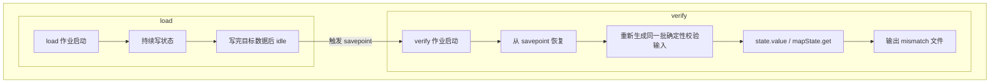

# HashMemTable Savepoint/Recovery 用例扩展示意

这份说明只覆盖已经落到 `flink-benchmarks` 仓库里的 workload，不复述之前未实现的候选场景。

## 目标

围绕已经复现成功的 `HashMemtableSavepointRiskJob`，补两类更贴近风险面的作业：

- `HashMemtableSavepointRmwRiskJob`
  - 用 `ValueState<String>` 做显式 `read -> modify -> write`，覆盖 Falcon cache 参与下的 RMW 路径。
- `HashMemtableSavepointMapStateRiskJob`
  - 用长字符串外层 key + 长字符串 map key，覆盖 `MapState` 的 prefix 敏感路径。

## 粗流程



## 现有与新增用例

| 作业 | 状态形态 | 主要覆盖点 | 推荐规模 |
| --- | --- | --- | --- |
| `HashMemtableSavepointRiskJob` | `ValueState<String>` | 已验证的 savepoint 丢状态最小闭包 | `--keys 500000` |
| `HashMemtableSavepointRmwRiskJob` | `ValueState<String>` | RMW、cache 命中、恢复后最终值一致性 | `--keys 250000 --updatesPerKey 2` |
| `HashMemtableSavepointMapStateRiskJob` | `MapState<String,String>` | 外层 key + map key 的 prefix 风险 | `--stateKeys 100000 --entriesPerKey 5` |

上面两组推荐规模都把总写入量抬到了约 50 万条，便于继续观察 memtable 到 L0/L1 的路径。

## 运行约定

四个作业都统一成两阶段：

- `--mode load`
  - 先写入完整状态，再进入 idle，便于对运行中作业触发 savepoint。
- `--mode verify`
  - 从 savepoint 恢复后重新生成确定性校验输入，只输出 mismatch。

典型步骤：

1. 启动 `load` 作业并等待其写完目标数据。
2. 对仍在运行的作业触发 savepoint。
3. 停掉 `load` 作业。
4. 用 `verify` 模式从 savepoint 恢复。
5. 检查 `output/part-*.tsv` 是否为空。

## 参数要点

- `parallelism`
  - 默认仍允许并行度 1；后续要覆盖多 key-group 时直接调高。
- `sourceParallelism`
  - 可以单独放大 source 并发，不影响 sink 的单文件输出。
- `checkpointIntervalMs`
  - 默认给很长间隔，避免普通 checkpoint 干扰 savepoint 观测。
- `eventsPerSecond`
  - 控制打压速度；如果要尽快制造更深层级 SST，可直接调大。

## 远端实测结果

实测环境：

- 远端地址：`10.101.160.224`
- 集群：`flink-unit1`
- 并行度：`1`
- 共享目录：`/opt/flink/log/hashmem_case_results`
- 统一覆盖：
  - `-Dstate.checkpoints.dir=file:///opt/flink/log/hashmem_case_results/checkpoints`
  - `-Dstate.backend.rocksdb.memory.managed=false`
- 说明：
  - 本节两条扩展 workload 的结果，全部基于修复后 runtime。
  - 这里的“修复后”特指 savepoint full snapshot iterator 已启用 `ReadOptions.setTotalOrderSeek(true)`。

### RMW 用例

- 作业：`HashMemtableSavepointRmwRiskJob`
- 目标：覆盖 `ValueState<String>` 的 `read -> modify -> write` 和 state cache 参与路径
- 额外配置：
  - `-Dstate.backend.rocksdb.falcon.use-state-cache=true`
  - `-Dstate.backend.rocksdb.falcon.state-cache-sizeLimit=20000`
  - `-Dstate.backend.rocksdb.falcon.state-cache-bypass-hitRatio=0.2`
- 参数：
  - `--keys 250000 --updatesPerKey 2 --eventsPerSecond 50000`
- 结果：
  - load job: `3fb687fe635f2d583b1c0e87643233bd`
  - savepoint: `file:/opt/flink/log/hashmem_case_results/rmw/savepoints/savepoint-3fb687-f7c37439bc7e`
  - verify job: `e3e9b732897a8773a42c4cefcb3013f2`
  - savepoint 目录大小：`38M`
  - mismatch 文件：`/opt/flink/log/hashmem_case_results/rmw/verify/part-0.tsv`
  - mismatch 行数：`0`

### MapState prefix 用例

- 作业：`HashMemtableSavepointMapStateRiskJob`
- 目标：覆盖长字符串 outer key + 长字符串 map key 的 `MapState` prefix 敏感路径
- 额外配置：
  - `-Dstate.backend.rocksdb.falcon.use-state-cache=false`
  - `-Dstate.backend.rocksdb.falcon.mapstate-cache.enabled=false`
- 参数：
  - `--stateKeys 100000 --entriesPerKey 5 --eventsPerSecond 50000`
- 结果：
  - load job: `bd30709ace2017c23d65df8dbb1029b7`
  - savepoint: `file:/opt/flink/log/hashmem_case_results/mapstate/savepoints/savepoint-bd3070-fcee94d145cc`
  - verify job: `821ce4226939316f6161077285752e58`
  - savepoint 目录大小：`76M`
  - mismatch 文件：`/opt/flink/log/hashmem_case_results/mapstate/verify/part-0.tsv`
  - mismatch 行数：`0`

### 备注

- `HashMemtableSavepointJoinRiskJob` 已从仓库移除。
- 原因不是它“没跑通”，而是代码核对后确认它只是自定义 `KeyedCoProcessFunction` + `ValueState<String>`，并不会进入 Falcon 实际优化的 `StreamingJoinOperator` 路径，所以它不能作为 `use-opt-join` 的有效覆盖用例。
- 当前新增 workload 中，实际保留的只有 `RMW` 和 `MapState prefix` 两类。当前仍然稳定复现异常的样例，仍是之前已经验证过的 `HashMemtableSavepointRiskJob`。

## 修复前补跑结果

这轮已经把 `HashMemtableSavepointRiskJob` 的修复前对照重新跑通，结果如下。

- 远端环境：`10.101.160.224 / flink-unit1`
- runtime 形态：
  - `flink-alg-falcon.jar` 已确认包含 `libfalcon.so`
  - `RocksDBFullSnapshotResources` 仍是 pre-fix 版本，未启用 `setTotalOrderSeek(true)`
  - `state.backend.rocksdb.memory.managed=false`
  - `state.backend.rocksdb.falcon.use-hash-memtable=true`
- 额外环境修正：
  - 这次先排除了一个与 savepoint iterator 无关、但会把 taskmanager 直接打崩的运行时问题：`state.backend.rocksdb.falcon.use-state-cache=true` 时，`HashMemtableSavepointRiskJob-load` 会稳定触发 native `SIGSEGV`，崩点在 `librocksdbjni-linux64.so / rocksdb::WriteThread::EnterAsBatchGroupLeader`。
  - 为了把实验收敛回 savepoint full snapshot 路径，这轮补跑显式把 `state.backend.rocksdb.falcon.use-state-cache` 关为 `false`；`hash memtable + prefix extractor + pre-fix savepoint` 这一主风险面保持不变。
- 作业与结果：
  - load job: `081c4b443820bcbfbd4d224487ff0c8b`
  - savepoint: `file:/opt/flink/log/hashmem_case_results/prefix_risk_prefx_nocache/savepoints/savepoint-081c4b-b3b17a204c04`
  - verify job: `20994f34a7541a9aa5c81000cf102d53`
  - savepoint 目录大小：`8.0K`
  - mismatch 文件：`/tmp/hashmem_risk_results/prefix_risk_prefx_nocache/verify/part-0.tsv`
  - mismatch 行数：`50000`
  - mismatch 前 5 行：

```text
0	00000000-state-key-00000000-abcdefghijklmnop	<null>	payload-00000000-00000000-abcdefghijklmnopqrstuvwxyz-0123456789
1	00000001-state-key-80000000-abcdefghijklmnop	<null>	payload-00000001-80000000-abcdefghijklmnopqrstuvwxyz-0123456789
2	00000002-state-key-40000000-abcdefghijklmnop	<null>	payload-00000002-40000000-abcdefghijklmnopqrstuvwxyz-0123456789
3	00000003-state-key-c0000000-abcdefghijklmnop	<null>	payload-00000003-c0000000-abcdefghijklmnopqrstuvwxyz-0123456789
4	00000004-state-key-20000000-abcdefghijklmnop	<null>	payload-00000004-20000000-abcdefghijklmnopqrstuvwxyz-0123456789
```

可以直接看出：pre-fix savepoint 中几乎没有把真实 `ValueState<String>` 内容带进去，restore 后同一批 key 全部读成了 `<null>`。这和修复后 savepoint 目录明显增大、并且 verify `0 mismatch` 的结果是对照成立的。

## 当前 Coverage 边界

当前这些 job 已经实际覆盖到的路径：

- `HashMemtableSavepointRiskJob`
  - `ValueState<String>` 直接写入 -> savepoint -> restore 后直接读取
- `HashMemtableSavepointRmwRiskJob`
  - `ValueState<String>` 的 `read -> modify -> write`
- `HashMemtableSavepointMapStateRiskJob`
  - 长字符串 outer key + 长字符串 map key 的 `MapState`

当前仍未被这组已执行样例覆盖的路径：

- 同一批扩展 workload 的 checkpoint restore 对照
- savepoint / checkpoint restore 之后继续写入的交错阶段
- 并行度大于 `1` 的多 key-group / rescale 路径
- `state.backend.rocksdb.memory.managed=true` 变体
